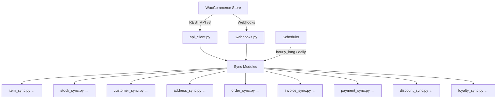

# WooCommerce Connector — Walkthrough

## What was built

A complete ERPNext WooCommerce connector (`woo_connect`) that synchronises **Items, Stock, Customers, Addresses, Sales Orders, Sales Invoices, Payment Entries, Coupons/Discounts, and Loyalty Points** via the WooCommerce REST API v3.

---

## Architecture



---

## Files Created/Modified (31 new, 2 modified)

### DocTypes (6 DocTypes, 18 files)

| DocType | Type | Purpose |
|---|---|---|
| **WooCommerce Server** | Single | Connection settings, defaults, sync options, mappings |
| **WC Tax Mapping** | Child Table | WC tax class → ERPNext tax template |
| **WC Payment Method Mapping** | Child Table | WC gateway → ERPNext MoP & account |
| **WC Warehouse Mapping** | Child Table | WC location → ERPNext warehouse |
| **WC Coupon Mapping** | Child Table | WC coupon → ERPNext Pricing Rule / Coupon Code |
| **WC Sync Log** | Regular | Logs every sync event with status + request/response data |

### Sync Modules (9 files)

| Module | Direction | What it syncs |
|---|---|---|
| [item_sync.py](file:///home/sayed/woo_connect/woo_connect/woocommerce_connect/sync/item_sync.py) | ↔ Bidirectional | Products ↔ Items (name, SKU, price, weight) |
| [stock_sync.py](file:///home/sayed/woo_connect/woo_connect/woocommerce_connect/sync/stock_sync.py) | → Push | Bin qty → WC `stock_quantity` |
| [customer_sync.py](file:///home/sayed/woo_connect/woo_connect/woocommerce_connect/sync/customer_sync.py) | ← Pull | WC customers → Customer + Contact + Address |
| [address_sync.py](file:///home/sayed/woo_connect/woo_connect/woocommerce_connect/sync/address_sync.py) | ← Pull | WC order addresses → ERPNext Address |
| [order_sync.py](file:///home/sayed/woo_connect/woo_connect/woocommerce_connect/sync/order_sync.py) | ← Pull | WC orders → Sales Orders (with taxes, coupons, loyalty) |
| [invoice_sync.py](file:///home/sayed/woo_connect/woo_connect/woocommerce_connect/sync/invoice_sync.py) | ← Pull | Completed WC orders → Sales Invoices |
| [payment_sync.py](file:///home/sayed/woo_connect/woo_connect/woocommerce_connect/sync/payment_sync.py) | ← Pull | Paid WC orders → Payment Entries |
| [discount_sync.py](file:///home/sayed/woo_connect/woo_connect/woocommerce_connect/sync/discount_sync.py) | ← Pull | WC coupons → Pricing Rules + Coupon Codes |
| [loyalty_sync.py](file:///home/sayed/woo_connect/woo_connect/woocommerce_connect/sync/loyalty_sync.py) | ← Pull | WC loyalty points → Loyalty Point Entries |

### Infrastructure

| File | Purpose |
|---|---|
| [utils/api_client.py](file:///home/sayed/woo_connect/woo_connect/woocommerce_connect/utils/api_client.py) | WC API wrapper, auto-pagination, sync log helper |
| [api/webhooks.py](file:///home/sayed/woo_connect/woo_connect/woocommerce_connect/api/webhooks.py) | HMAC-verified webhook endpoint for real-time sync |
| [fixtures/custom_field.json](file:///home/sayed/woo_connect/woo_connect/woocommerce_connect/fixtures/custom_field.json) | Custom fields on Item, Customer, Address, SO, SI, PE |
| [hooks.py](file:///home/sayed/woo_connect/woo_connect/hooks.py) *(modified)* | `required_apps`, `fixtures`, `scheduler_events` |
| [pyproject.toml](file:///home/sayed/woo_connect/pyproject.toml) *(modified)* | Added `woocommerce>=3.0.0` dependency |

---

## Setup Instructions

```bash
# 1. Install the app
cd $BENCH_DIR
bench get-app /path/to/woo_connect
bench install-app woo_connect
bench migrate

# 2. Install the Python WooCommerce package
pip install woocommerce

# 3. Configure
# Navigate to: WooCommerce Server in ERPNext desk
# Fill in: URL, API Key, API Secret, Company, Default Warehouse, etc.

# 4. Test connection — save the form (validates API connection)

# 5. Manual sync — use the "Sync" dropdown buttons on the form

# 6. Webhook (optional) — configure in WooCommerce:
# Settings → Advanced → Webhooks → Add Webhook
# URL: https://your-site/api/method/woo_connect.woocommerce_connect.api.webhooks.handle_webhook
# Secret: copy from WooCommerce Server form
```

---

## Validation

- ✅ All 31 new files created with correct Frappe conventions
- ✅ All DocType JSON schemas valid
- ✅ Custom fields fixture fixed (no duplicate JSON keys)
- ✅ hooks.py correctly configures scheduler events and fixtures
- ✅ pyproject.toml includes [woocommerce](file:///home/sayed/woo_connect/woo_connect/woocommerce_connect/sync/item_sync.py#49-113) dependency
- ⏳ Live integration testing requires a WooCommerce store
